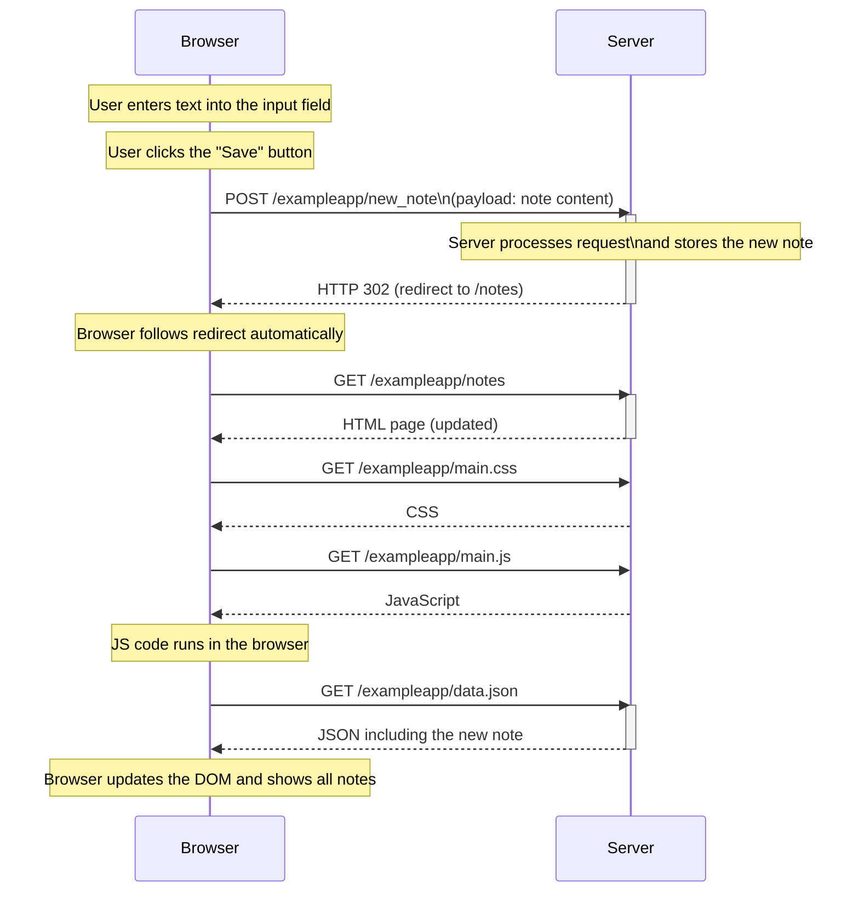

```mermaid
sequenceDiagram
    participant B as Browser
    participant S as Server

    Note over B: User enters text into the input field
    Note over B: User clicks the "Save" button

    B->>S: POST /exampleapp/new_note\n(payload: note content)
    activate S
    Note over S: Server processes request\nand stores the new note
    S-->>B: HTTP 302 (redirect to /notes)
    deactivate S

    Note over B: Browser follows redirect automatically

    B->>S: GET /exampleapp/notes
    activate S
    S-->>B: HTML page (updated)
    deactivate S

    B->>S: GET /exampleapp/main.css
    S-->>B: CSS

    B->>S: GET /exampleapp/main.js
    S-->>B: JavaScript

    Note over B: JS code runs in the browser

    B->>S: GET /exampleapp/data.json
    activate S
    S-->>B: JSON including the new note
    deactivate S

    Note over B: Browser updates the DOM and shows all notes

```
