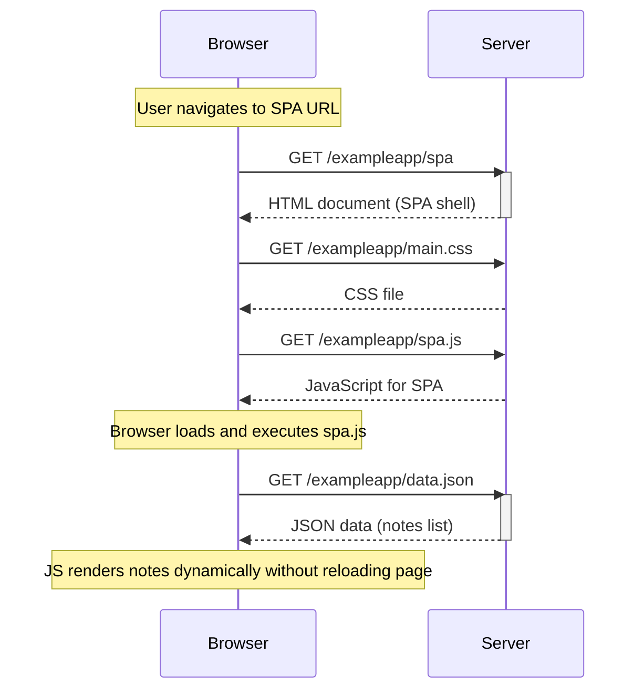

```mermaid
sequenceDiagram
    participant B as Browser
    participant S as Server

    Note over B: User navigates to SPA URL

    B->>S: GET /exampleapp/spa
    activate S
    S-->>B: HTML document (SPA shell)
    deactivate S

    B->>S: GET /exampleapp/main.css
    S-->>B: CSS file

    B->>S: GET /exampleapp/spa.js
    S-->>B: JavaScript for SPA

    Note over B: Browser loads and executes spa.js

    B->>S: GET /exampleapp/data.json
    activate S
    S-->>B: JSON data (notes list)
    deactivate S

    Note over B: JS renders notes dynamically without reloading page
```
