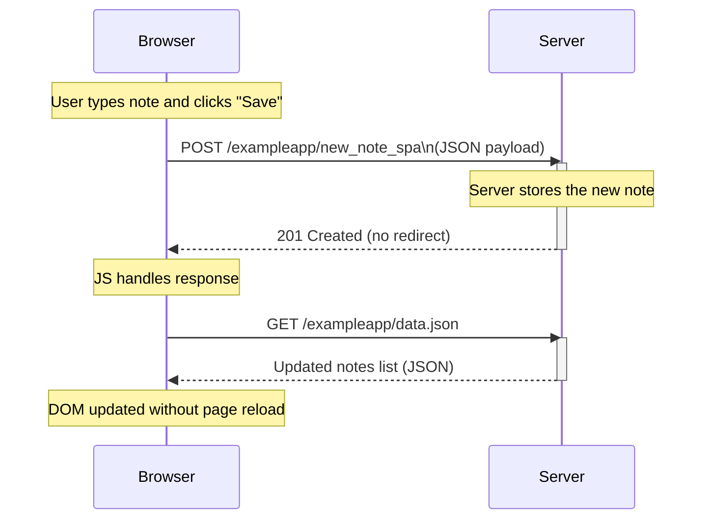

```mermaid
sequenceDiagram
    participant Browser
    participant Server

    Note over Browser: User types note and clicks "Save"

    Browser->>Server: POST /exampleapp/new_note_spa\n(JSON payload)
    activate Server
    Note over Server: Server stores the new note
    Server-->>Browser: 201 Created (no redirect)
    deactivate Server

    Note over Browser: JS handles response

    Browser->>Server: GET /exampleapp/data.json
    activate Server
    Server-->>Browser: Updated notes list (JSON)
    deactivate Server

    Note over Browser: DOM updated without page reload
```
